# WebApp Project by Group B - FINAL REPORT

#### NAME AND MATRIC NUMBER OF GROUP MEMBERS:  
1. NUR EILYANA EIRDYNA BINTI ISMAIL (2222692)
2. NURUL IZZAH BINTI KAMARUL AZHAR (2310174)
3. FARAH NUR ATHIRAH BINTI SUKARDAN (2310960)  
4. NUR IRDINA BINTI ABD RAHMAN (2213414)
5. UMMU HANIE BINTI MOHD NOR (2313274) 

## TITLE OF THE PROJECT 

#### TasteOS – A Laravel-Based Shariah-Compliant Café Management System for Campus Entrepreneurs

## INTRODUCTION OF THE PROJECT

In merely a decade, youth-oriented cafe culture, primarily that of college students, has metamorphosed from casual social interaction into a statement of lifestyle, entrepreneurship, and community involvement. This change is even more evident in academic settings such as the International Islamic University Malaysia (IIUM), where cafes basically serve as meeting points for students and entrepreneurs. Nevertheless, many of these cafe enterprises are still plagued with the very common problems of manual order processing, irregular inventory control, and a lack of service area integration.

This project seeks to tackle the discovered inefficiencies by creating a cafe management system based on Laravel technology, provisionally referred to as **TasteOS**. The proposed solution will help student entrepreneurs, startup cafe owners, and campus vendors improve backend processes and customer service using the Model-View-Controller (MVC) architecture that Laravel is based on.

#### The system will provide:
- A centralized online platform to manage menus and process orders.
- Basic inventory management to track ingredients to ensure items are not understocked or overstocked.
- A role-based authentication system for various types of employees and café owners.
- A user interaction module that tracks simple input from customers.

#### The goal of this project by our team is to assist by:
- Using effective and safe digital technologies to modernize small & medium-sized cafes.
- Encouraging university students to engage in business activities in an Islamic context.
- Providing a management tool that is easy to use and abides by moral and corporate regulations.

This Laravel web application will try to close a technical gap that is often overlooked by providing a functional, relevant, and contextual response that represents the real-life operating conditions that IIUM students and other young cafe owners will encounter.

## OBJECTIVES OF THE PROJECT 

This project aims to provide a meaningful and ethical digital solution to the evolving cafe market, particularly for those initiated or managed by student entrepreneurs within university environments such as IIUM. This Laravel application is designed to improve business management while supporting the personal and professional development of young operators to lead the way in the marketplace and respond to the need for systems that are efficient, secure, and compliant with Shariah.

#### The main objectives are:
- To design and build a modular web-based application to effectively manage the operations of a cafe utilizing the Model-View-Controller (MVC) architectural design pattern in Laravel. This includes processing ingredients to make ordered drinks, inventory management, the ability to change menu items, and easy customer-facing interactions.
  
- To motivate undergraduate students to pursue responsible digital entrepreneurship by integrating role-based access control, structured processes, and ethical business conduct into an accessible and educational system framework.

- To provide a platform that is scalable and contextualized to assist small to medium-sized cafe enterprises—particularly campus-based ones—enabling them to upgrade using a solution that maintains Islamic values and improves quality of service and sustainability in the long run.

## FEATURES AND FUNCTIONALITIES OF THE PROJECT
#### 1. Menu Management 
- Add/Delete/Edit menu items (CRUD)
- Categorize items (e.g: drinks, pastries)
- Upload images, prices and descriptions

#### 2. Point of Sale (POS) System (Staff Module)
- New order creation: select items, quantity, table service/takeaway
- Auto price calculation
- Reak-time order status: Payment Pending, Preparing, Completed
- Print receipt

#### 3. Order Queue Management
- Display active orders by time/status
- Live update of kitchen queue
- Filter by table, type (dine-in/takeaway) or staff

#### 4. Inventory Management (Admin Module)
- Add/Delete/Edit ingredients (CRUD)
- Track stock levels
- Set low stock alerts or restock reminders

#### 5. Customer & Loyalty System
- Register customers
- Track order history per customer
- Award loyalty points per order
- View and redeem awards

#### 6. Reporting & Analytics
- Daily/weekly/monthly sales reports
- Best-selling items and slow movers

## SEQUENCE DIAGRAM 

#### 1. Menu Management (Admin Module)

#### 2. Point of Sale (POS) System (Staff Module) and Order Queue Management

#### 3. Inventory Management (Admin Module)

#### 4. Customer & Loyalty System

#### 5. Reporting & Analytics

## PROJECT SYSTEM CAPTURED SCREEN AND EXPLANATION

#### 1. Menu Management 

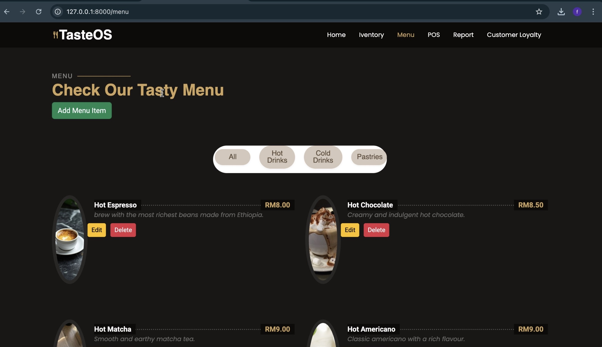

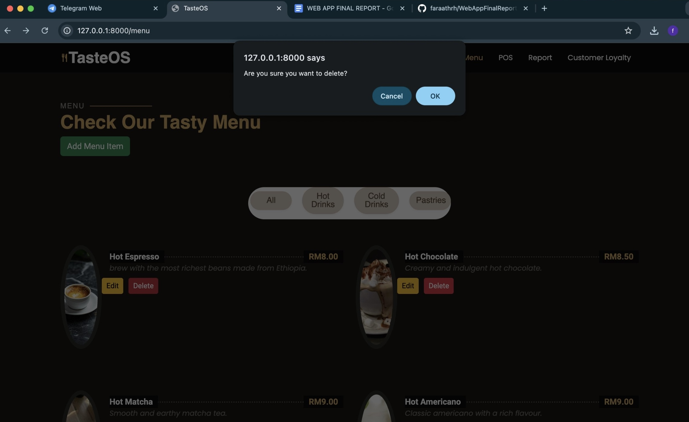

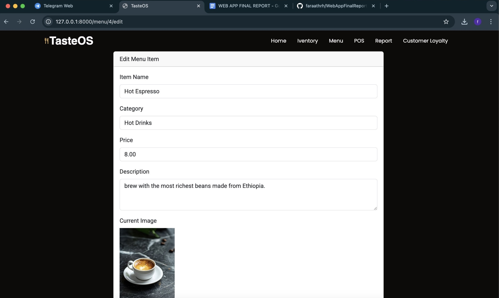

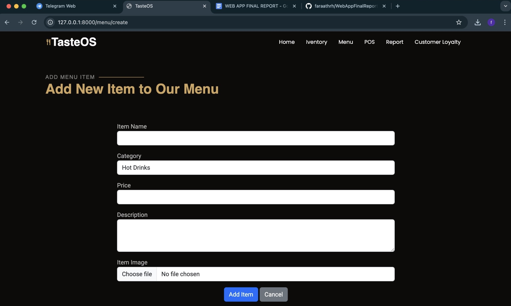

  In the Laravel Menu System, the Menu model essentially holds powers over the data and its interaction with the database. It was built upon an MVC architecture. It explicitly informs which fields can be set by mass assignment: name, description, price, category, and image. It contains accessors such as formattedPrice (to format the display of a price) and imageUrl (to build a full image URL). The application's business logic is handled inside the MenuController. It contains methods such as create() to display a form for the creation of an item, index() to show all menu items, store() to validate input and save new items along with the submitted image, and edit() and update() to allow updating the item information of an existing menu item, as well as optionally changing the image by removing the previous one and saving a new one.
  
  A menu item and the image that goes with it are deleted from storage using the destroy() function.  The user interface is provided on the frontend using Blade views such as menu.create, menu.edit, and menu.index.  While the edit view enables altering existing items, the create view includes a form for adding new ones.  With jQuery-based category filtering and the ability to add or remove items, the index view presents every menu item in a fluid and filterable layout.  To guarantee correct operation, all interactions are protected against cross-site request forgery (CSRF) and make advantage of Laravel's routing and validation capabilities.

#### 2. Point of Sale (POS) System and Order Queue Management
In the Laravel POS System, the POSController manages order-related logic using Laravel’s MVC architecture. It handles menu display, cart operations using sessions, checkout validation, and order saving. When users add items to the cart, they’re stored in the session. During checkout, processCheckout() validates input, saves the order to the orders table, and each item to the ordered_items table.

The system uses Blade views:
1. POS.blade.php for menu selection and cart,
2. checkout.blade.php for payment selection and order summary,
3. receipt.blade.php for printing a receipt with item details, payment method, status, and timestamp.

Session data is cleared after the order is placed. Printing is optimized with CSS for A6 paper. Laravel’s routing, session handling, and CSRF protection ensure smooth, secure operation.

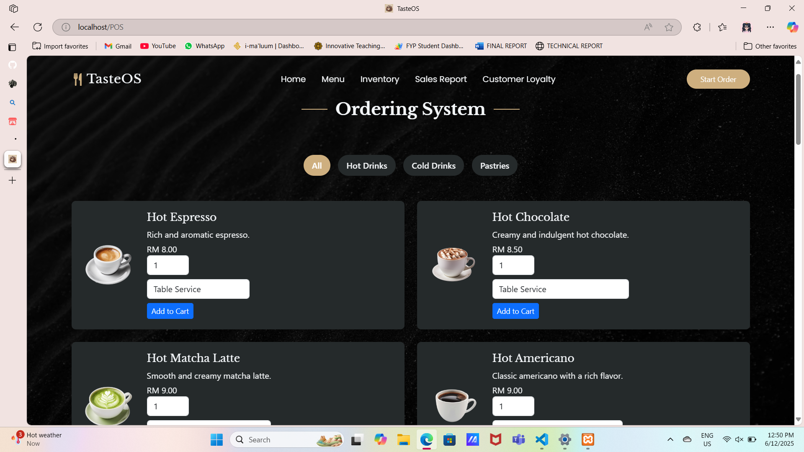
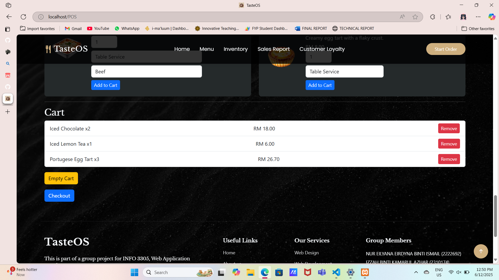
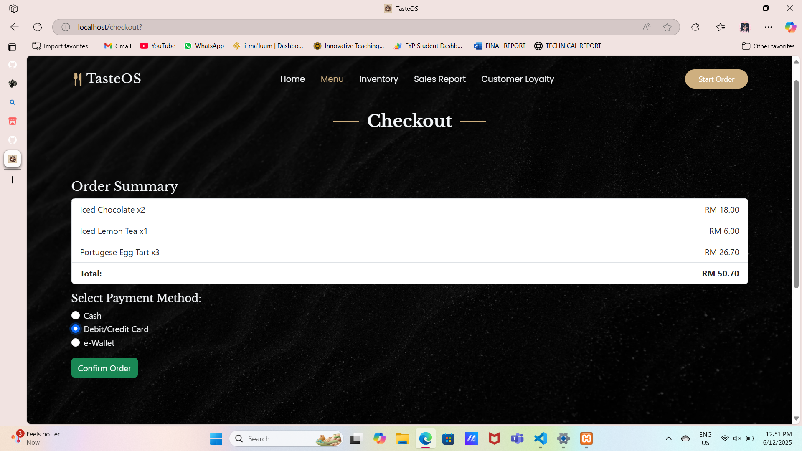
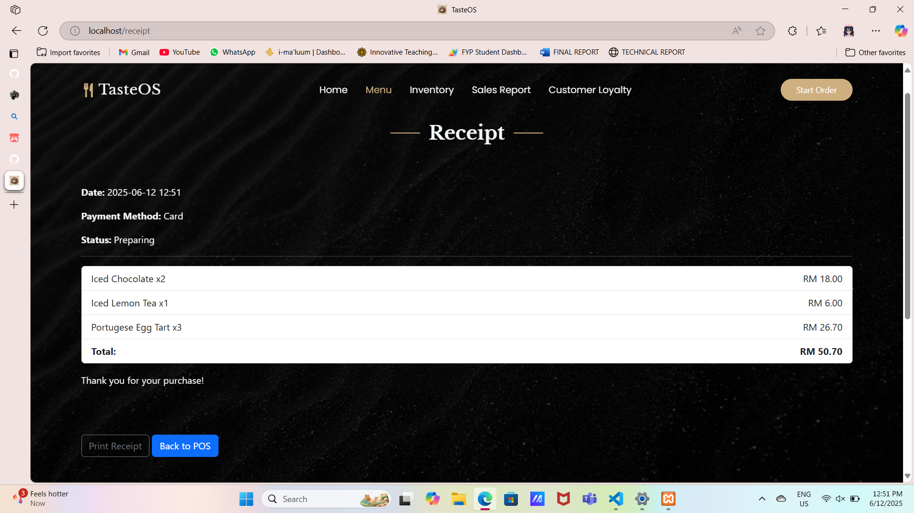
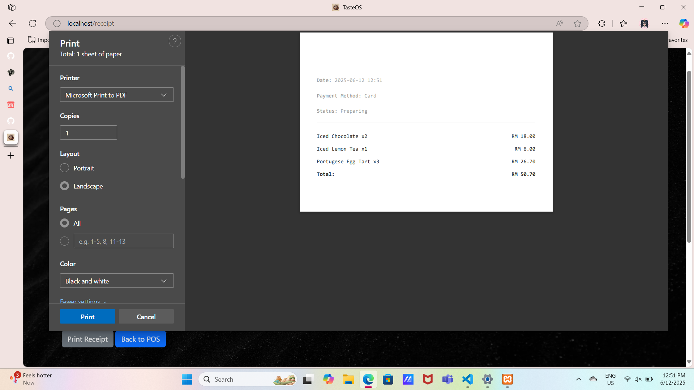

#### 3. Inventory Management 
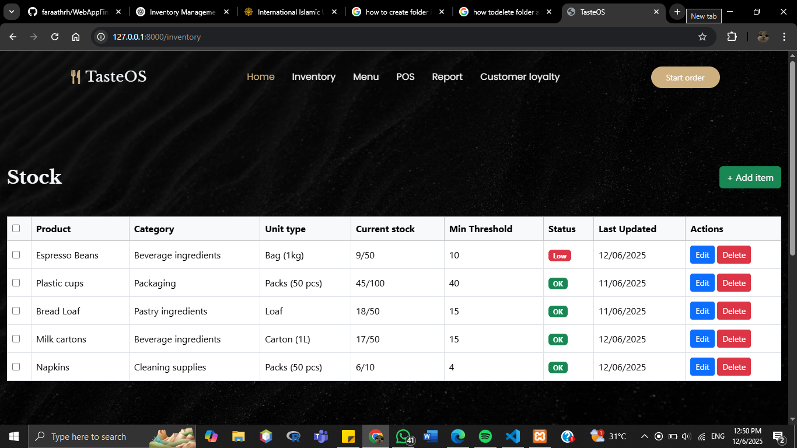
In the Laravel Inventory Management module, stock-related operations are handled following Laravel’s MVC structure. The module includes key views such as `index.blade.php` for listing all inventory items, `create.blade.php` and `form.blade.php` for adding new stock, and `edit.blade.php` for modifying existing records. Users can perform **CRUD operations**—adding, editing, and deleting stock items for both café and event inventory.

Each stock item includes quantity tracking, and the system provides **status indicators** to show whether a stock level is **low** or **sufficient**, enhancing proactive inventory control. The backend logic checks stock thresholds and updates indicators accordingly. This ensures real-time monitoring and smooth stock management across different operational areas.

#### 4. Customer & Loyalty System

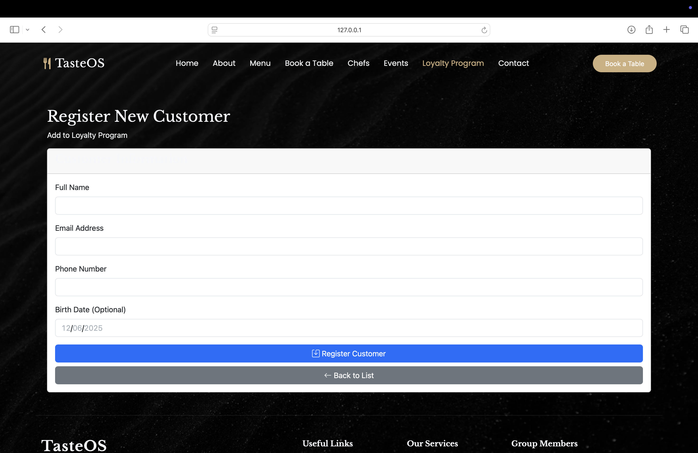

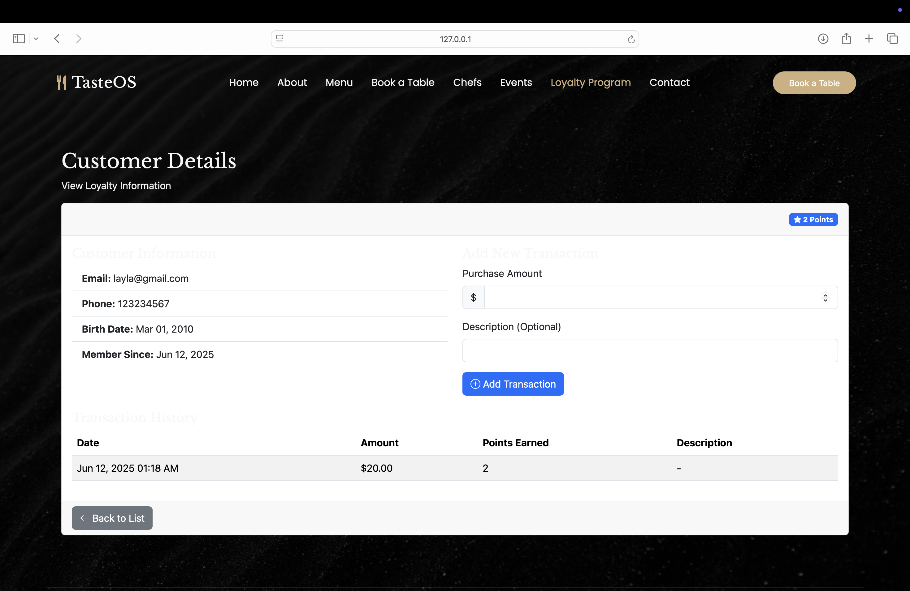

In the Laravel Customer Loyalty System, LoyaltyController manage customer registrations, track their purchases and automatically assign loyalty points based on spending. It's part of a loyalty program intended to encourage repeat purchases and customer retention. 

The key features are:
1. Customer Registration:
   - Admin/staff can register customers with name and email
   - Each customer is uniquely identified by their email
   - Loyalty points start at 0 upon registration
2. View Customers:
   - List all of the customers along with their total points
   - Option to view and edit any customer profile
3. Purchase Tracking:
   - Each customers have purchase records history
4. Point Calculation:
   - Points are calculated as 1 point for every RM10 spent
   - When a purchase is saved, customer's total loyalty points are updated automatically

#### 5. Reporting & Analytics

## CHALLENGES / DIFFICULTIES TO DEVELOP THE APPLICATION

One of the hardest challenges during the project was constantly switching between views, controllers, and routes to ensure everything was correctly connected. Small mistakes in route names, form methods, or controller logic often caused repeated and confusing errors. This became even more difficult when merging **authentication logic** like user login, access control, and role-based permissions—with our existing Blade templates. Integrating these elements required modifying multiple files and ensuring templates only displayed content based on user roles, which often broke the layout or caused redirect issues. Balancing Laravel’s authentication flow with custom UI templates was time-consuming and required a deep understanding of both Laravel’s structure and Blade.

